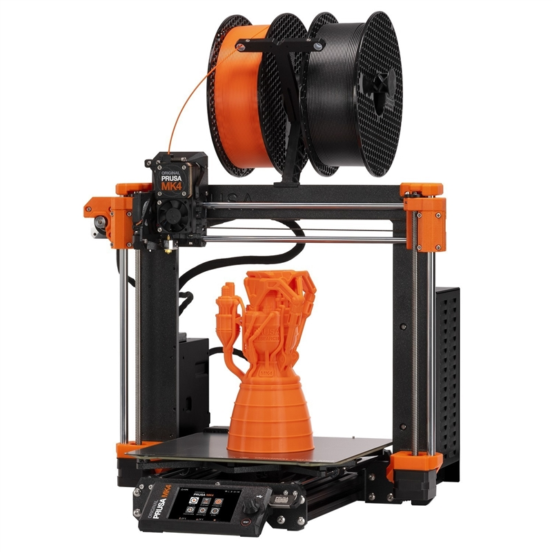
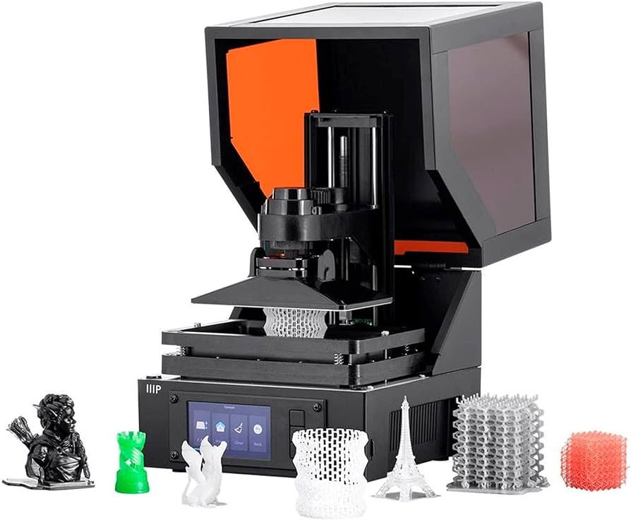

# Manufacture 製造

* [3D Printing 3D列印]()
    * FDM
    * LCD
* [Laser Cutting 雷射切割]()

## 3D Printing 3D列印
* Comparison between __FDM__ and __LCD__ 3D printers.
* FDM與LCD 3D列印機之比較.
<table>
  <tr>
    <td>Machine</td>
    <td></td>
    <td></td>
  </tr>
  <tr>
    <td>Speed</td>
    <td>Faster</td>
    <td>Slower</td>
  </tr>
  <tr>
    <td>hardness</td>
    <td>Higher</td>
    <td>Lower</td>
  </tr>
  <tr>
    <td>Tensile</td>
    <td>Lower</td>
    <td>Higher</td>
  </tr>
</table>

### FDM

### LCD
1. LCD光固化3D列印機

## Laser Cutting 雷射切割