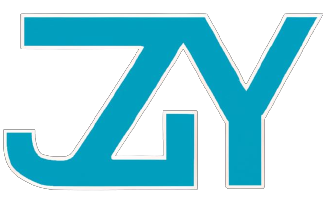

# Project_EDU

> This repository's mainly used to store some teaching materials & program examples.
> All of the files're for __educational__ purposes only.
> [License](LICENSE)

## Contents 目錄

* Future Engineers 未來工程師
    * [About Rules 關於規則]()
    * [Examples from previous 往年範例]()
    * [Examples from other conutries 其他國家範例]()
* Python
    * [Basic program syntax 基本程式語法]()
    * [Function and Class 函數和物件導向]()
* Linux System (Jetson & Raspberry Pi)
    * [History 發展史]()
    * [Setup 設定]()
    * [Basic code 基本代碼應用]()
* 2D/3D CAD
    * [AutoCAD]()
    * [Solidworks]()
    * [Onshape]()
* Manufacture 製造
    * [3D Printing 3D列印]()
    * [Laser Cutting 雷射切割]()
    * [Lathe 車床]()
    * [Milling machine 銑床]()